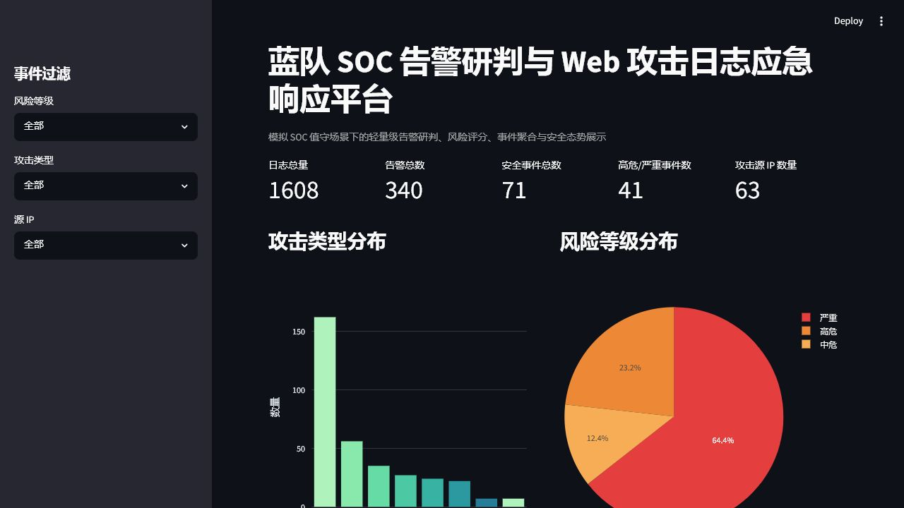
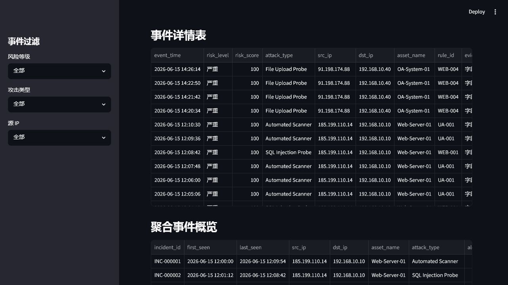

# Blue-Team-SOC-Alert-Triage

> 蓝队 SOC 告警研判与 Web 攻击日志应急响应平台  
> A local blue-team SOC alert triage and web attack incident response project for GitHub showcase, resume presentation, and interview discussion.


## 项目简介

本项目模拟蓝队 SOC 值守场景，围绕 Web 访问日志、认证失败日志、Suricata IDS 告警和资产清单，构建一套轻量级的安全告警研判平台。系统支持本地样例数据生成、日志解析、统一标准化、攻击识别、风险评分、事件聚合、日报导出、单事件应急响应报告和 Streamlit 安全态势可视化。

项目完全离线运行，不依赖公网目标、不扫描真实网站、不攻击真实系统，适合作为蓝队初级实习、SOC 分析岗、安全运营岗的高质量展示项目。

## 展示效果

### 仪表盘总览



### 高危事件视图



## 项目背景

在真实 SOC 值守工作中，分析人员通常需要同时处理多源异构日志：

- Web 访问日志：分析 SQL 注入、XSS、敏感文件探测、目录扫描、文件上传探测等行为。
- 认证日志：识别异常失败登录、弱口令爆破和高频尝试。
- IDS 告警日志：从网络侧补充攻击签名和高危线索。
- 资产信息：判断业务重要性、暴露面和潜在业务影响。

本项目将这些能力压缩为一个易运行、易讲解、易截图展示的本地工程，用于体现日志分析、规则设计、资产关联、风险建模和事件响应输出的完整思路。

## 项目亮点

- 从 0 到 1 构建完整 SOC 告警研判流水线，而不是单点脚本。
- 本地生成多源模拟日志，保证离线可复现与安全边界清晰。
- 对 Web、Auth、Suricata 三类日志做统一标准化与资产画像关联。
- 落地关键词规则、频率规则和 IDS 严重级规则，贴近蓝队值守流程。
- 引入资产等级、暴露面、状态码、扫描器指纹、源 IP 告警密度等多因子风险评分。
- 按 10 分钟窗口聚合事件，并自动输出研判结论与处置建议。
- 自动生成 Excel 安全日报、Markdown 单事件报告和 Streamlit 仪表盘。
- 适合 GitHub 首页展示、简历项目链接和面试讲解。

## 技术栈

- Python 3.10+
- pandas
- pyyaml
- openpyxl
- streamlit
- plotly

## 项目架构图

```text
                +---------------------------+
                |   src/generate_sample_data.py
                |   本地生成模拟日志与资产清单
                +-------------+-------------+
                              |
                              v
    +----------------+  +----------------+  +----------------------+
    | access.log     |  | auth.log       |  | suricata_eve.json    |
    | Web访问日志    |  | 认证日志       |  | IDS/EVE JSON日志     |
    +--------+-------+  +--------+-------+  +----------+-----------+
             |                   |                     |
             v                   v                     v
   +----------------+  +----------------+  +----------------------+
   | parse_access   |  | parse_auth     |  | parse_suricata_eve   |
   +--------+-------+  +--------+-------+  +----------+-----------+
             \                   |                    /
              \                  |                   /
               +-----------------------------------+
               | normalize_events.py              |
               | 统一字段 + 关联资产画像          |
               +----------------+------------------+
                                |
                                v
               +----------------+------------------+
               | detection_engine.py              |
               | 关键词规则 / 频率规则 / IDS规则  |
               +----------------+------------------+
                                |
                                v
               +----------------+------------------+
               | risk_score.py                    |
               | 风险评分与风险等级分类           |
               +----------------+------------------+
                                |
                                v
               +----------------+------------------+
               | incident_aggregation.py          |
               | 10分钟窗口聚合安全事件           |
               +----------------+------------------+
                                |
                    +-----------+-----------+
                    |                       |
                    v                       v
       +--------------------------+   +----------------------+
       | report_generator.py      |   | dashboard/app.py     |
       | Excel日报 + Markdown报告 |   | Streamlit态势仪表盘  |
       +--------------------------+   +----------------------+
```

## 功能模块

### 1. 模拟数据生成

- 生成 `assets.csv` 资产画像。
- 生成 `access.log` Web 访问日志，覆盖正常流量和攻击样例。
- 生成 `auth.log` 认证日志，覆盖成功、失败与爆破场景。
- 生成 `suricata_eve.json`，覆盖 `alert/http/dns/flow` 多类事件。

### 2. 日志解析

- 解析 Nginx/Apache 风格访问日志。
- 解析自定义认证日志格式。
- 解析 Suricata EVE JSON。

### 3. 事件标准化

- 统一事件字段模型。
- 按 `dst_ip` 关联资产画像。
- 输出 `normalized_events.csv` 供后续检测与分析使用。

### 4. 规则检测

- 关键词匹配规则。
- 5 分钟频率规则。
- IDS 高危严重级规则。

### 5. 风险评分

- 按攻击类型设置基础分。
- 按资产重要性、暴露面、状态码、扫描器指纹等维度加权。
- 输出统一 `risk_score` 与 `risk_level`。

### 6. 事件聚合

- 按 `src_ip + dst_ip + asset_name + attack_type + 10分钟时间窗口` 聚合。
- 自动生成 `disposition` 研判结论。
- 汇总证据、规则与处置建议。

### 7. 报告与可视化

- 生成 Excel 蓝队值守日报。
- 生成 Markdown 单事件应急响应报告。
- 生成 Streamlit 安全态势仪表盘。

## 数据字段说明

### `assets.csv`

| 字段 | 说明 |
| --- | --- |
| asset_id | 资产编号 |
| asset_name | 资产名称 |
| ip | 资产 IP |
| system_type | 系统类型 |
| business_level | 业务等级 |
| owner | 资产负责人 |
| exposure | 暴露面 |

### `normalized_events.csv`

| 字段 | 说明 |
| --- | --- |
| event_time | 事件时间 |
| src_ip | 攻击源 IP |
| dst_ip | 目标 IP |
| asset_name | 目标资产 |
| business_level | 业务等级 |
| exposure | 暴露面 |
| log_source | 日志来源 |
| event_type | 事件类型 |
| request_method | 请求方法 |
| request_uri | 请求 URI |
| status_code | HTTP 状态码 |
| user_agent | User-Agent |
| username | 登录用户名 |
| auth_result | 认证结果 |
| signature | IDS 签名 |
| severity | IDS 严重级 |
| raw_message | 原始日志 |

### `detected_alerts.csv`

| 字段 | 说明 |
| --- | --- |
| alert_id | 告警编号 |
| attack_type | 攻击类型 |
| rule_id | 规则编号 |
| matched_field | 命中字段 |
| matched_value | 命中内容 |
| severity | 规则严重级 |
| evidence | 证据摘要 |
| recommendation | 处置建议 |

## 检测规则说明

规则文件位于 [rules/detection_rules.yaml](rules/detection_rules.yaml)，内置以下规则：

- `WEB-001` SQL Injection Probe
- `WEB-002` XSS Probe
- `WEB-003` Sensitive File Scan
- `WEB-004` File Upload Probe
- `UA-001` Automated Scanner
- `AUTH-001` Brute Force Login
- `WEB-005` Directory Brute Force
- `IDS-001` IDS High Severity Alert

## 风险评分模型

### 基础分

- SQL Injection Probe：40
- File Upload Probe：40
- Brute Force Login：40
- IDS Alert：35
- XSS Probe：25
- Directory Brute Force：25
- Sensitive File Scan：25
- Automated Scanner：20

### 加权因子

- 目标资产 `business_level = core`：+20
- 目标资产 `business_level = high`：+10
- `exposure = public`：+10
- `status_code = 500`：+15
- `user_agent` 命中 `sqlmap / nikto / dirbuster`：+20
- 同一 `src_ip` 告警数超过 10：+15

### 风险等级

- 0-29：低危
- 30-59：中危
- 60-79：高危
- 80-100：严重

## 事件聚合逻辑

- 聚合维度：`src_ip + dst_ip + asset_name + attack_type + 10分钟时间窗口`
- 聚合方式：事件时间向下取整到 10 分钟
- 输出内容：首次出现时间、最后出现时间、告警数量、命中规则、最高风险分、风险等级、证据摘要、研判结论、处置建议

## 快速开始

### 1. 安装依赖

```bash
pip install -r requirements.txt
```

### 2. 运行主流程

```bash
python run_pipeline.py
```

### 3. 启动仪表盘

```bash
streamlit run dashboard/app.py
```

## 输出结果说明

运行后将生成以下核心文件：

- `data/raw/access.log`
- `data/raw/auth.log`
- `data/raw/suricata_eve.json`
- `data/raw/assets.csv`
- `data/processed/normalized_events.csv`
- `data/processed/detected_alerts.csv`
- `data/processed/risk_scored_events.csv`
- `data/processed/incident_summary.csv`
- `reports/daily_security_report.xlsx`
- `reports/incident_report.md`


## 安全声明

本项目仅用于蓝队防守学习、日志分析训练、检测规则演示和安全作品集展示。

- 不扫描真实网站
- 不攻击真实目标
- 不连接公网目标
- 所有攻击样例仅用于本地模拟日志分析

请勿将本项目用于任何未授权攻击、扫描、渗透或破坏性行为。
